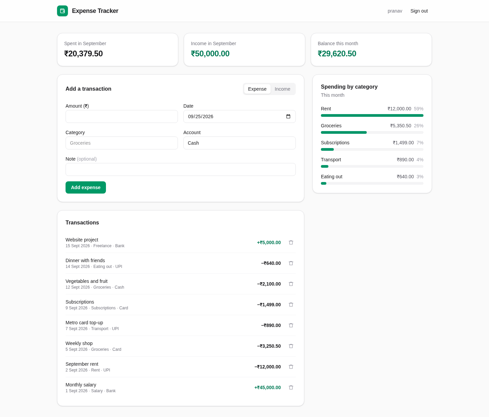
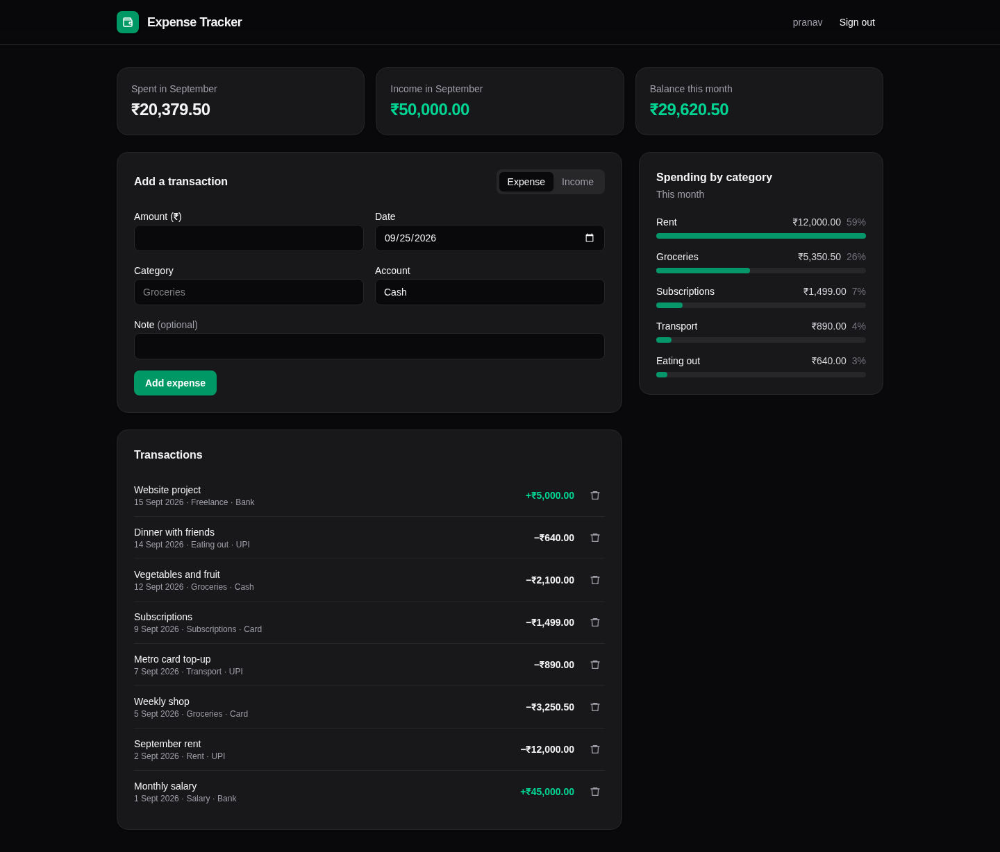
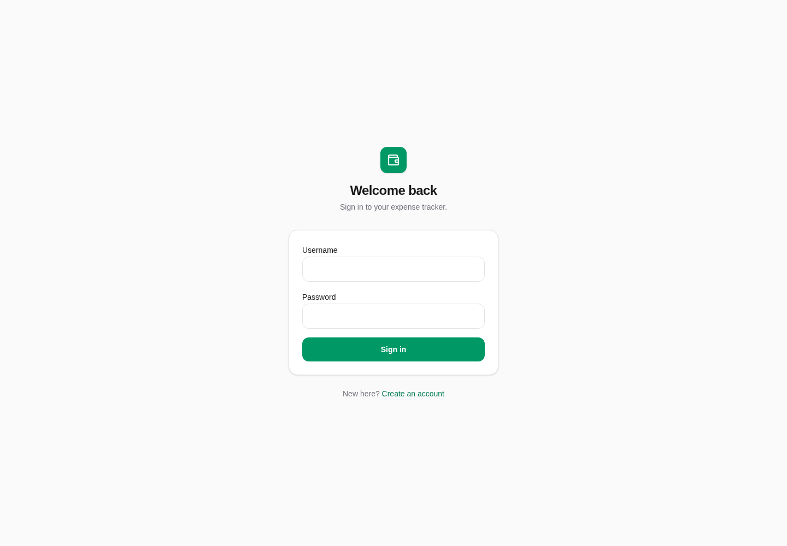
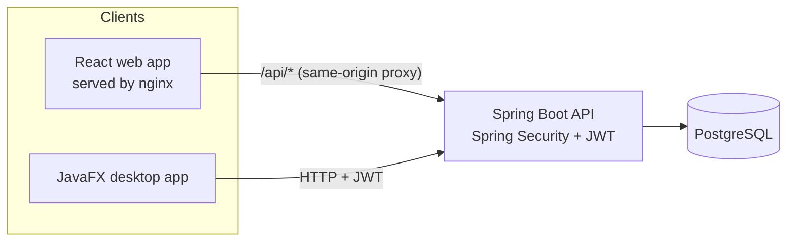

# Personal Expense Tracker

A full-stack expense tracker with a Spring Boot API, a PostgreSQL database, and two clients: a React web app and a JavaFX desktop app.
Users sign up, log in with JWT auth, and track income and expenses by category and account.
The whole stack starts with one `docker compose up`.

[](https://github.com/pranav6266/personal-expense-tracker/actions/workflows/ci.yml)



<details>
<summary>Dark mode and sign-in</summary>




</details>

## Architecture



| Part | Folder | Stack |
|---|---|---|
| API | [`backend/`](backend) | Java 21, Spring Boot 3.5, Spring Security, JWT (jjwt), Spring Data JPA, Actuator |
| Database | - | PostgreSQL 16 |
| Web client | [`web/`](web) | React 19, Vite, Tailwind CSS 4, React Router, Axios, nginx |
| Desktop client | [`desktop/`](desktop) | Java 21, JavaFX 21, MaterialFX, Gson |

## Features

- Sign up and log in; stateless JWT authentication with BCrypt-hashed passwords.
- Role-based access: users manage their own expenses, and admins can list users.
- Expenses are scoped to their owner, so one user can never read another user's data.
- Filter by day, by category and month, and list all categories.
- Web dashboard with monthly spending, income and balance, plus spending by category.
- Light and dark themes that follow the system setting.
- Health endpoint (`/actuator/health`) used by Docker healthchecks.

## Quick start (Docker)

Requirements: Docker with Compose v2.

```bash
cp .env.example .env
# Set POSTGRES_PASSWORD, and JWT_SECRET to the output of: openssl rand -base64 32
docker compose up -d --build --wait
```

- Web app: http://localhost:3000
- API: http://localhost:8080 (health at `/actuator/health`)

Create an account from the web app's sign-up page.
To also seed an admin account, set `ADMIN_PASSWORD` in `.env` before the first start.

Stop the stack with `docker compose down`, or `docker compose down -v` to also delete the database volume.

### Desktop client

With the API running, either run the client in Docker (Linux with X11):

```bash
./scripts/run-desktop.sh
```

or run it directly with JDK 21:

```bash
cd desktop
./gradlew run -Dexpense.api.baseUrl=http://localhost:8080
```

## Local development

| Task | Command |
|---|---|
| API tests (H2 in-memory, no Docker needed) | `cd backend && ./gradlew test` |
| Run the API against a local Postgres | `cd backend && ./gradlew bootRun` |
| Web dev server | `cd web && npm ci && npm run dev` (set `VITE_API_BASE_URL=http://localhost:8080`) |
| Lint the web app | `cd web && npm run lint` |

The API reads its settings from environment variables; see [`.env.example`](.env.example) and [`backend/src/main/resources/application.yml`](backend/src/main/resources/application.yml).

## API

| Method | Path | Auth | Description |
|---|---|---|---|
| POST | `/signup` | public | Create an account |
| POST | `/login` | public | Get a JWT |
| GET | `/auth/validate` | user | Current username and role |
| GET | `/expenses` | user | All of your expenses |
| GET | `/expenses/id/{id}` | user | One expense |
| GET | `/expenses/day/{date}` | user | Expenses on a day (`YYYY-MM-DD`) |
| GET | `/expenses/categories` | user | Your categories |
| GET | `/expenses/category/{category}/month?month=YYYY-MM` | user | Expenses in a category for a month |
| POST | `/expenses` | user | Create an expense (returns 201) |
| PUT | `/expenses/{id}` | user | Update an expense |
| DELETE | `/expenses/{id}` | user | Delete an expense |
| GET | `/admin/users` | admin | List users |
| GET | `/actuator/health` | public | Health check |

Send the token as `Authorization: Bearer <token>`.

## History

This repository merges two earlier repositories, [`personal-expense-tracker-backend`](https://github.com/pranav6266/personal-expense-tracker-backend) and [`personal-expense-tracker-frontend`](https://github.com/pranav6266/personal-expense-tracker-frontend), with their full commit history, and adds the React web client and Docker setup.

## License

[MIT](LICENSE)
